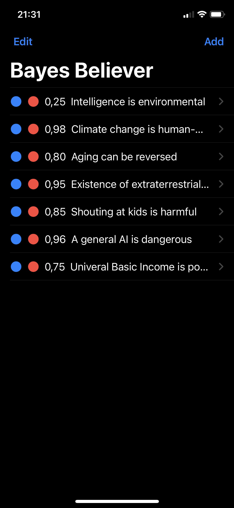

# Bayes-Believer
An iOS app that supports Bayesian thinking

Screenshot with *random* degrees of beliefs:

## Formal Background

Bayes' theorem describes how to infer beliefs based on observations and their likelihood (the rest is commentary 😉):

where B is the belief and D is the observational data.

This app is supposed to update beliefs iteratively.
There could be supporting observations several times and with varying true positive rates.
Therefore, we make beliefs time-dependent:

However, this allows only supporting observations.
To also support opposing observations, we use this formula:

With both derivations, the app can generate a sequence of (refined) beliefs.
