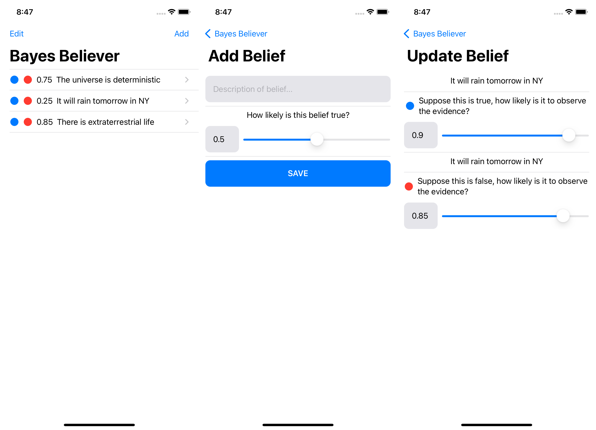

# Bayes-Believer
An iOS app that supports Bayesian thinking



## Motivation

While I was reading [The Scount Mindset](https://www.penguinrandomhouse.com/books/555240/the-scout-mindset-by-julia-galef/), I had the idea for an app that supports Bayesian thinking. The app lets you organize a couple of believes that you can update on new pieces of information.

## Installation

Building and running an iOS app requires a Mac computing with Xcode installed.

Download source code and open Xcode:
```sh
git clone https://github.com/mo42/Bayes-Believer.git
cd Bayes-Believer
open Bayes Believer.xcodeproj
```

Details in Xcode might change. Usually, it involves selecting a simulator or an actual iOS device and then hitting the ▶ button.


## Formal Background

Bayes' theorem describes how to infer beliefs based on observations and their likelihood:

$P(B | D) = \frac{P(D | B) \cdot P(B)}{P(D)}$,

where B is the belief and D is the observational data.

This app is supposed to update beliefs iteratively.
There could be supporting observations several times and with varying true positive rates.
Therefore, we make beliefs time-dependent:

$P(B_{t+1} | D) = \frac{P(D | B_t) \cdot P(B_t | D)}{P(D)}$.

However, this allows only supporting observations.
To also support opposing observations, we use this formula:

$P(B_{t+1} | \neg D) = \frac{P(\neg D | B_t) \cdot P(B_t | \neg D)}{P(\neg D)}$.

With both derivations, the app can generate a sequence of (refined) beliefs.

## License

This project is open source software licensed under the MIT License.

See the LICENSE file for more information.